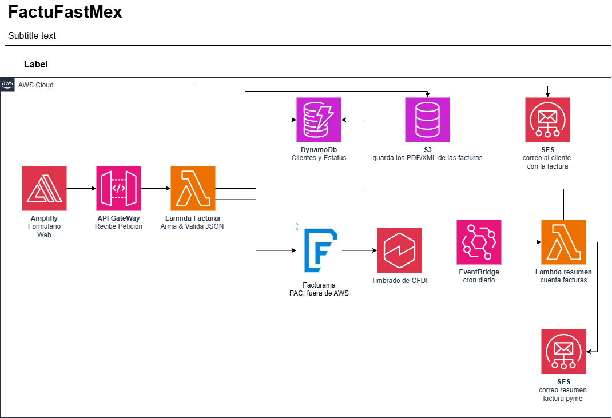

# FactuFastAI

Serverless MVP for generating CFDI 4.0 electronic invoices (Mexico) built on AWS. A business sends 4 fields and receives a stamped invoice by email.

> Runs against Facturama sandbox — invoices generated have no legal validity.

---

## Stack

| Layer | Technology |
|---|---|
| Frontend | Static HTML + CSS + JS deployed on **AWS Amplify** |
| API | **API Gateway** (REST) |
| Backend | **AWS Lambda** · Python 3.12 · SAM |
| Database | **DynamoDB** On-Demand (`pk=rfc`, `sk=folio_fiscal`) |
| Email | **Amazon SES v2** (S3 pre-signed URL) |
| PAC (stamping) | **Facturama** Multi-issuer sandbox API |
| Credentials | **AWS SSM Parameter Store** |
| IaC | **AWS SAM** (`template.yaml`) |

---

## Architecture



<details>
<summary>Text version</summary>

```
Form (Amplify)
      ↓
 API Gateway  POST /facturas
      ↓
 Lambda crear_factura
      ├─ 1. validate_fields()
      ├─ 2. Facturama API → stamped CFDI
      ├─ 3. DynamoDB → write status + fiscal folio
      ├─ 4. S3 → store PDF/XML
      └─ 5. SES → send download link to recipient
```

</details>

---

## Project Structure

```
factufast/
├── backend/
│   ├── src/
│   │   ├── handlers/
│   │   │   └── crear_factura.py     # Main Lambda handler
│   │   ├── services/
│   │   │   └── facturama.py         # Facturama API client
│   │   └── utils/
│   │       ├── db.py                # DynamoDB write helpers
│   │       ├── validators.py        # RFC, postal code, tax regime validation
│   │       └── response.py          # HTTP 200/400/500 helpers
│   ├── layers/python/
│   │   └── requirements.txt         # Dependencies packaged as Lambda Layer
│   ├── events/
│   │   └── crear_factura.json       # Test event for sam local invoke
│   ├── tests/
│   │   └── conftest.py
│   ├── requirements.txt
│   ├── samconfig.toml
│   └── template.yaml                # SAM IaC (Lambda + API GW + DynamoDB)
├── frontend/                        # React Native app (Expo)
│   ├── app/
│   │   ├── index.tsx                # Main screen (invoice form)
│   │   └── resultado.tsx            # Result screen (folio + PDF/XML links)
│   ├── components/
│   │   └── CampoFormulario.tsx      # Reusable form field component
│   ├── services/
│   │   └── api.ts                   # API Gateway fetch (single connection point to backend)
│   ├── constants/
│   │   └── regimenes.ts             # SAT tax regime catalog
│   ├── app.json                     # Expo config
│   ├── package.json
│   └── tsconfig.json
├── amplify.yml                      # Amplify CI/CD build spec
├── .env.example                     # Local dev environment variables
├── .gitignore
└── proyecto-facturacion-mvp.md      # Full technical reference document (Spanish)
```

---

## Prerequisites

- [AWS CLI](https://aws.amazon.com/cli/) configured (`aws configure`)
- [AWS SAM CLI](https://docs.aws.amazon.com/serverless-application-model/latest/developerguide/install-sam-cli.html)
- Python 3.12
- [Facturama sandbox](https://apisandbox.facturama.mx) account

---

## Setup

### 1. Store Facturama credentials in SSM

```bash
aws ssm put-parameter \
  --name /factufast/facturama_user \
  --value "YOUR_SANDBOX_USER" \
  --type SecureString

aws ssm put-parameter \
  --name /factufast/facturama_pass \
  --value "YOUR_SANDBOX_PASS" \
  --type SecureString
```

### 2. Upload the test CSD to Facturama (one-time)

```bash
# Run locally with a Python script before deploying
# See section 4.1 of proyecto-facturacion-mvp.md
python scripts/cargar_csd.py
```

### 3. Local environment variables

```bash
cp .env.example .env
# Edit .env with your sandbox credentials
```

---

## Deploy

```bash
cd backend

# First time
sam build
sam deploy --guided

# Subsequent deploys
sam build && sam deploy
```

SAM prints the `ApiUrl` at the end — paste it into `frontend/app.js`.

---

## Local Testing

```bash
cd backend

# Invoke Lambda with the test event
sam local invoke CrearFacturaFunction --event events/crear_factura.json

# Start local API (requires Docker)
sam local start-api
```

---

## Before End-to-End Testing

1. **SES — verify identities**: AWS Console → SES → Verified identities. Verify both the sender email and the test recipient email. SES sandbox only sends to verified addresses.
2. **SES — create Configuration Set**: SES → Configuration sets → create `factufast-config`.

---

## Sandbox vs Production

| | Sandbox | Production |
|---|---|---|
| Issuer RFC | `EKU9003173C9` (test) | Real business RFC |
| CSD | Facturama test certificate | Real CSD issued by SAT |
| Facturama account | Free, no paperwork | Paid subscription + activate Multi-issuer |
| CFDI validity | None (apocryphal) | Legally valid before SAT |
| Code | Same | Same — only the data changes |
| Facturama URL | `apisandbox.facturama.mx` | `api.facturama.mx` |
| SES | Sandbox (verified addresses only) | Verify full domain + DKIM/SPF/DMARC |

---

## Design Decisions

- **DynamoDB On-Demand** — no RCU/WCU capacity planning; auto-scales and stays within Free Tier for low volumes.
- **Single `put_item` after Facturama** — Lambda writes to DynamoDB after the stamping call, not before, avoiding a double-write on error.
- **`ConditionExpression` on `put_item`** — prevents client retries from overwriting an already-saved record (`ConditionalCheckFailedException`).
- **S3 pre-signed URL instead of PDF attachment** — SES sends a 24h download link; attaching binaries requires manual MIME construction.
- **SSM Parameter Store** for Facturama credentials — no plaintext environment variables.
- **RFC + postal code validation before the folio counter** — a bad RFC caught early means no wasted folio numbers.
