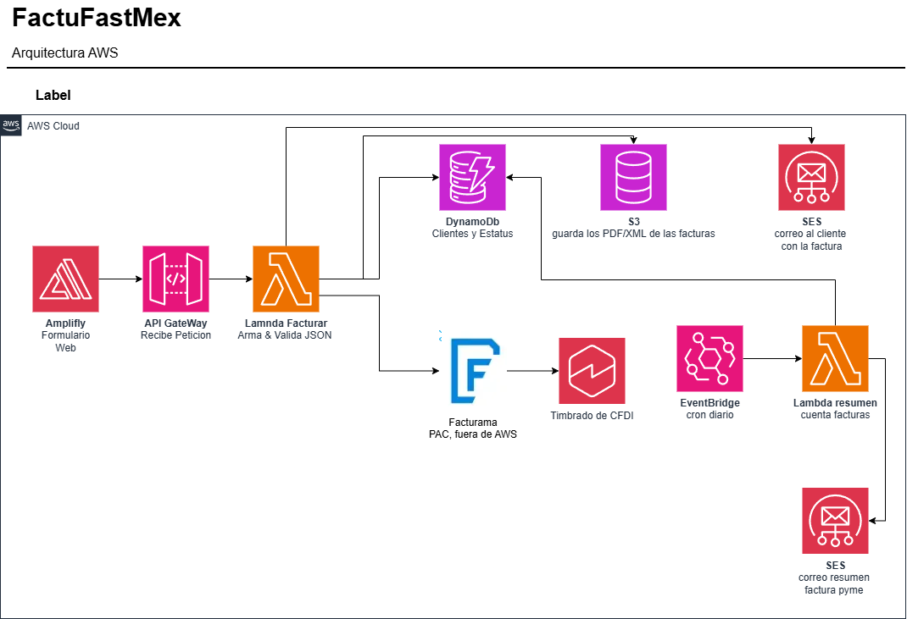

# FactuFastAI

Serverless MVP for generating CFDI 4.0 electronic invoices (Mexico) built on AWS. A business sends 4 fields and receives a stamped invoice by email.

> Runs against Facturama sandbox — invoices generated have no legal validity.

---

## Stack

| Layer | Technology |
|---|---|
| Frontend | **React 18** · Vite 5 · TypeScript · Tailwind CSS · AWS Amplify |
| API | **API Gateway** (REST) · API Key auth |
| Backend | **AWS Lambda** · Python 3.12 · SAM |
| Database | **DynamoDB** On-Demand · GSI `fecha-estatus-index` |
| Storage | **S3** — PDF/XML with pre-signed URLs (1h expiry) |
| Email | **Amazon SES v2** · Configuration Sets per stream |
| Scheduler | **EventBridge Scheduler** — daily summary (Mexico City tz) |
| PAC (stamping) | **Facturama** Multi-issuer sandbox API |
| Credentials | **AWS SSM Parameter Store** |
| IaC | **AWS SAM** (`backend/template.yaml`) |

---

## Architecture



<details>
<summary>Text version</summary>

```
React App (Amplify)
      ↓
 API Gateway  POST /facturas  [x-api-key]
      ↓
 Lambda crear_factura
      ├─ 1. validate_fields()
      ├─ 2. increment folio (CountersTable atomic counter)
      ├─ 3. Facturama API → stamped CFDI (UUID)
      ├─ 4. DynamoDB → write status + folio (ConditionExpression)
      ├─ 5. S3 → store PDF/XML
      └─ 6. SES → send pre-signed URL to recipient

 EventBridge Scheduler (daily 6pm MX)
      ↓
 Lambda resumen_diario
      ├─ query GSI fecha-estatus-index
      └─ SES → daily summary email to business
```

</details>

---

## Project Structure

```
factufast/
├── backend/
│   ├── src/
│   │   ├── handlers/
│   │   │   ├── crear_factura.py        # Main Lambda handler
│   │   │   └── resumen_diario.py       # Daily summary Lambda
│   │   ├── services/
│   │   │   └── facturama.py            # Facturama API client
│   │   └── utils/
│   │       ├── db.py                   # DynamoDB helpers (ConditionExpression, TTL)
│   │       ├── s3.py                   # S3 upload + pre-signed URL
│   │       ├── email.py                # SES v2 send
│   │       ├── validators.py           # RFC, postal code, tax regime validation
│   │       └── response.py             # HTTP 200/400/500 helpers
│   ├── layers/python/
│   │   └── requirements.txt            # Lambda Layer dependencies
│   ├── events/
│   │   └── crear_factura.json          # Test event for sam local invoke
│   ├── tests/
│   │   └── conftest.py                 # moto fixtures (DynamoDB + S3)
│   ├── requirements.txt
│   ├── samconfig.toml
│   └── template.yaml                   # SAM IaC
├── frontend/
│   ├── src/
│   │   ├── components/
│   │   │   ├── layout/
│   │   │   │   └── Header.tsx
│   │   │   └── ui/
│   │   │       └── ErrorBoundary.tsx
│   │   ├── pages/
│   │   │   ├── factura/
│   │   │   │   ├── Formulario.tsx      # CFDI form (RFC, CP, regime, email)
│   │   │   │   └── Resultado.tsx       # Result screen (UUID + PDF/XML)
│   │   │   └── auth/                   # (ready for Login)
│   │   ├── services/
│   │   │   └── api.ts                  # API Gateway fetch client
│   │   ├── constants/
│   │   │   └── regimenes.ts            # SAT tax regime catalog (19 regimes)
│   │   ├── hooks/                      # (ready for custom hooks)
│   │   └── types/                      # (ready for shared types)
│   ├── index.html
│   ├── vite.config.ts
│   ├── tailwind.config.js
│   └── package.json
├── scripts/
│   ├── cargar_csd.py                   # Upload test CSD to Facturama (one-time)
│   └── test_timbrado.py                # Standalone stamp test (no AWS needed)
├── amplify.yml                         # Amplify CI/CD build spec
├── .env.example
└── proyecto-facturacion-mvp.md         # Full technical reference (Spanish)
```

---

## Prerequisites

- [AWS CLI](https://aws.amazon.com/cli/) configured (`aws configure`)
- [AWS SAM CLI](https://docs.aws.amazon.com/serverless-application-model/latest/developerguide/install-sam-cli.html)
- Python 3.12
- Node.js 18+
- [Facturama sandbox](https://apisandbox.facturama.mx) account

---

## Setup

### 1. Store credentials in SSM

```bash
aws ssm put-parameter --name /factufast/facturama_user --value "YOUR_USER" --type SecureString
aws ssm put-parameter --name /factufast/facturama_pass --value "YOUR_PASS" --type SecureString
aws ssm put-parameter --name /factufast/ses_from_email --value "you@yourdomain.com" --type SecureString
```

### 2. Upload test CSD to Facturama (one-time)

```bash
python scripts/cargar_csd.py
```

### 3. Local environment variables

```bash
cp .env.example .env
# Edit .env with your sandbox credentials
```

---

## Deploy

### Backend

```bash
cd backend
sam build
sam deploy --guided   # first time — saves config to samconfig.toml
sam build && sam deploy  # subsequent deploys
```

SAM prints the `ApiUrl` at the end — add it to Amplify environment variables.

### Frontend

```bash
cd frontend
npm install
npm run dev       # local dev server → http://localhost:5173
npm run build     # production build → dist/
```

**AWS Amplify** — connect the repo and set these environment variables in the console:

| Variable | Value |
|---|---|
| `VITE_API_URL` | API Gateway URL from SAM output |
| `VITE_API_KEY` | API Key from API Gateway console |

Add one rewrite rule: `/<*>` → `/index.html` (type: 404 rewrite) for SPA routing.

---

## Local Testing

```bash
cd backend

# Invoke Lambda with test event
sam local invoke CrearFacturaFunction --event events/crear_factura.json

# Start local API (requires Docker)
sam local start-api
```

---

## Before End-to-End Testing

1. **SES — verify identities**: AWS Console → SES → Verified identities. Verify both sender and recipient emails (sandbox only sends to verified addresses).
2. Configuration Sets (`factufast-config`, `factufast-resumen-config`) are created automatically by SAM — do not create manually.

---

## Sandbox vs Production

| | Sandbox | Production |
|---|---|---|
| Issuer RFC | `EKU9003173C9` (test) | Real business RFC |
| CSD | Facturama test certificate | Real CSD issued by SAT |
| Facturama account | Free, no paperwork | Paid + Multi-issuer activated |
| CFDI validity | None (apocryphal) | Legally valid before SAT |
| Facturama URL | `apisandbox.facturama.mx` | `api.facturama.mx` |
| SES | Sandbox (verified addresses only) | Verified domain + DKIM/SPF/DMARC |

---

## Design Decisions

- **DynamoDB On-Demand** — no capacity planning; auto-scales within Free Tier for low volumes.
- **Atomic folio counter** — `CountersTable` with `ADD` expression guarantees sequential folios without gaps even under concurrent requests.
- **ConditionExpression on `put_item`** — prevents client retries from overwriting an already-saved record.
- **S3 pre-signed URL (1h)** — avoids attaching binaries to SES; URL contains RFC and fiscal data so expiry respects LFPDPPP.
- **Two SES Configuration Sets** — `factufast-config` (transactional) and `factufast-resumen-config` (batch) keep reputation metrics isolated.
- **EventBridge Scheduler with `ScheduleExpressionTimezone`** — native Mexico City timezone support, no manual UTC offset calculation.
- **SSM Parameter Store** — no plaintext credentials in environment variables or source code.
